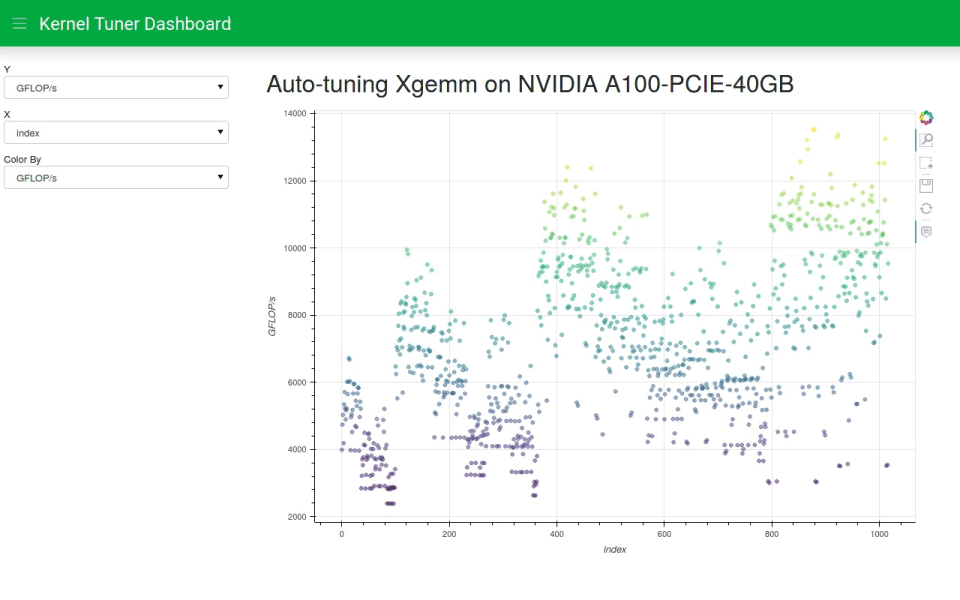

# KTdashboard - monitor your Kernel Tuner runs

KTdashboard allows you to monitor, analyze, and visualize an active or completed auto-tuning run of [Kernel 
Tuner](https://github.com/benvanwerkhoven/kernel_tuner/), a tool for automatic optimization of CPU and GPU computational 
kernels.



## Installation

For the moment the installation instructions are:
```
git clone git@github.com:benvanwerkhoven/dashboard.git
cd dashboard
pip install -e .

```
We plan to add ktdashboard to pypi in the future.

## Usage

To turn up your first dashboard and test if your installation works, type:
```
ktdashboard -demo tests/test_cache_1000.json
```
This creates a KTdashboard using a test cache with about a 1000 different benchmark configurations in it.
The ``-demo`` switch enables demo mode, which means that KTdashboard mimicks a live tuning run.

KTdashboard uses Kernel Tuner's cachefiles to visualize the auto-tuning results as they come in. Cache files are used within 
Kernel Tuner to record all information about all benchmarked kernel configurations. This allows the tuner to do several 
powerful things, such as continuing where it had left off in a previous tuning session, or simulate auto-tuning runs for 
benchmarking search algorithms and hyperparameter optimization. Because Kernel Tuner appends new results to the cache during 
benchmarking, KTdashboard can use this to keep track of the results collected so far and monitor your auto-tuning experiments 
for new results as they come in.

When you are using Kernel Tuner for a long auto-tuning run be sure to use the option ``cache=my_cache_filename.json``. This 
allows you to monitor the tuner's progress using:
```
ktdashboard my_cache_filename.json
```

## License, contributions, citation

KTdashboard is considered part of the Kernel Tuner project, for licensing, contribution guide, and citation information please see
[Kernel Tuner](https://github.com/benvanwerkhoven/kernel_tuner/).

